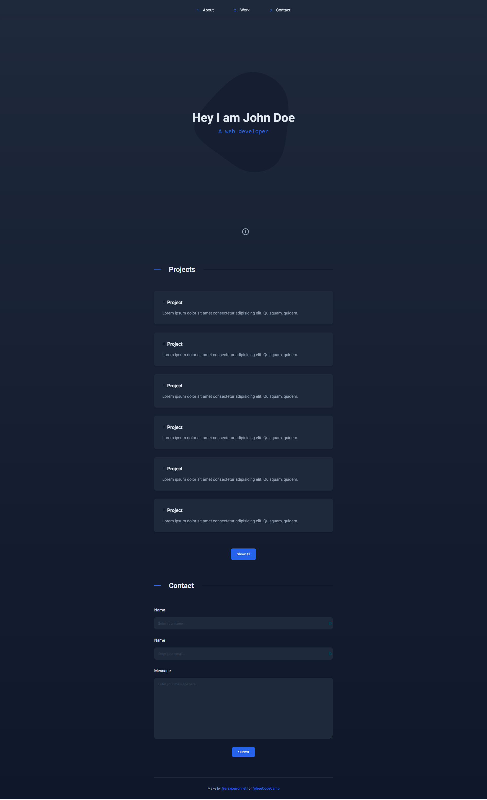

# freeCodeCamp - Personal Portfolio Webpage

Responsive Web Design - Personal Portfolio Webpage

## Tech Stack

- HTML
- CSS

## Project Specifications

### Objective

Build an app that is functionally similar to [https://personal-portfolio.freecodecamp.rocks](https://personal-portfolio.freecodecamp.rocks)

### User Stories

- [x] Your portfolio should have a welcome section with an `id` of `welcome-section`
- [x] The welcome section should have an `h1` element that contains text
- [x] Your portfolio should have a projects section with an `id` of `projects`
- [x] The projects section should contain at least one element with a `class` of `project-tile` to hold a project
- [x] The projects section should contain at least one link to a project
- [x] Your portfolio should have a navbar with an `id` of `navbar`
- [x] The navbar should contain at least one link that you can click on to navigate to different sections of the page
- [x] Your portfolio should have a link with an `id` of `profile-link`, which opens your GitHub or freeCodeCamp profile in a new tab
- [x] Your portfolio should have at least one media query
- [x] The height of the welcome section should be equal to the height of the viewport
- [x] The navbar should always be at the top of the viewport

## Demo

For a demo, check out [https://alexperronnet.github.io/freecodecamp-personal-portfolio-webpage/](https://alexperronnet.github.io/freecodecamp-personal-portfolio-webpage/)

## Screenshots

